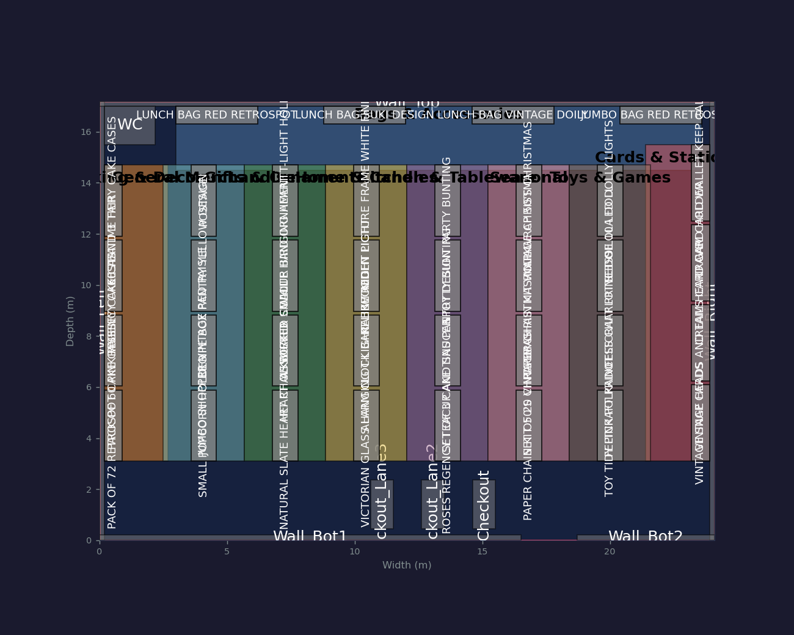
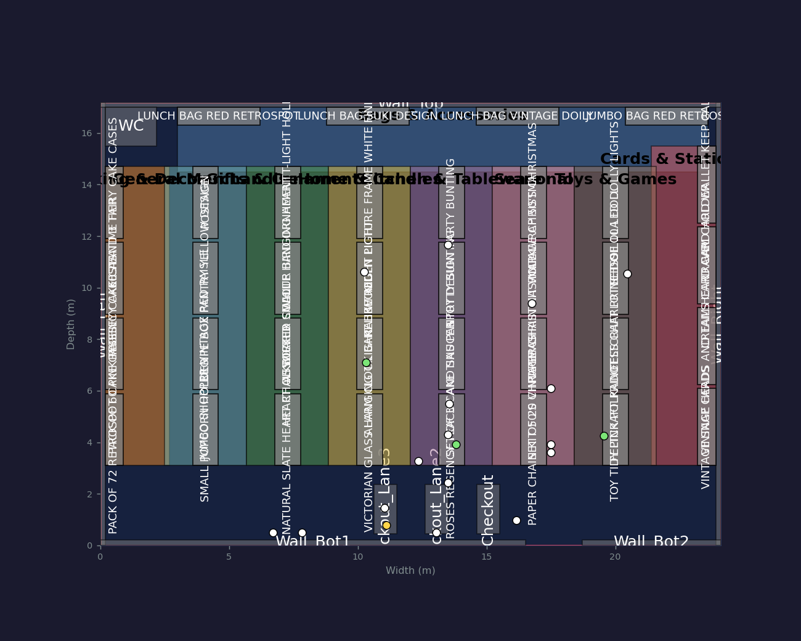

# Retail Layout Simulator

> **Full source: [Asinoth/retail-layout-simulator](https://github.com/Asinoth/retail-layout-simulator)**
>
> This directory is a summary. The code lives in its own repository
> because it is a research project with its own test suite, experiment
> harness and reproduction pipeline.

A multi-floor, 2D agent-based simulator for retail shop layouts, written
to support a submission to *ACM Transactions on Modeling and Computer
Simulation*. The research question is whether better item placement
produces a measurable, dataset-calibrated revenue lift in a confined
retail space — and, more importantly, whether a simulation-based
optimizer finds different answers than a closed-form one.

## What it does

**Build a floor plan.** Items, walls, sections, multiple floors joined by
stairs and connectors. A floor-plan engine generates realistic layouts
from three archetypes drawn from the retail literature — grid (grocery,
pharmacy), racetrack (electronics, bookstore) and freeform (clothing,
cafe) — guaranteeing no overlapping fixtures, minimum aisle widths, and
door-to-item reachability.

**Calibrate against real data.** A typed adapter and calibration pipeline
ingests public retail datasets, fits the simulator's parameters to them,
and stamps provenance: SHA-256 of the source file, schema version,
adapter version, and the resolved package versions. Empirical
distributions are written directly into the analytics layer so the
analytical engines see real values from the first tick.

**Simulate customers.** Pedestrians arrive as a non-homogeneous Poisson
process with an hour-of-day intensity profile, walk the shop on A*
paths, browse, queue at the least-loaded checkout lane, and either buy or
abandon.

**Optimize the layout.** A five-phase pipeline: collect a pre-window of
data, run the analytical engines (Monte Carlo, sensitivity/tornado,
Markov chain, and a genetic algorithm over item placement), apply the
best layout found, collect a post-window, then A/B test pre against post
with Welch's t-test, a two-sample KS test and Cohen's d.

**Validate.** Empirical-versus-simulated distribution overlays for basket
size, per-visit revenue, category share and walking speed, with KS and
chi-square goodness-of-fit tests.

## What makes it a research artifact rather than a demo

- **Every literature-derived coefficient lives in one auditable module**,
  with its citation attached, rather than inline as a magic number.
- **A synthetic ground-truth harness.** Shops are generated with known
  closed-form optimal layouts, so the optimizer's *regret* against a
  known answer can be measured rather than asserted.
- **Equal-budget comparators.** The genetic algorithm is benchmarked
  against random search and simulated annealing given the same number of
  objective evaluations, plus four informed heuristic baselines — so any
  claimed advantage is not just a bigger compute budget.
- **Common random numbers and multi-seed final selection** throughout the
  paired comparisons, so Monte Carlo noise does not decide the winner.
- **Reproducibility scaffolding**: pinned dependencies, a one-command
  reproduction driver, a pytest suite over the numeric core, standalone
  invariant checks for the geometry engine, and a JSON sidecar for every
  experiment run recording git SHA, RNG seed and parameter snapshot.

The headline methodological finding is that the simulation-based
optimizer and a closed-form revenue model **rank layouts differently** —
the simulator captures dwell, flow and queueing effects the analytical
model omits.

## Status

The source repository is **public**: the full simulator, the headless
experiment runners, the pytest numeric-core suite and the reproduction
drivers are all there.

The **manuscript itself is withheld** while the paper is under
submission, and will be added on publication. The two screenshots above
show the application.
